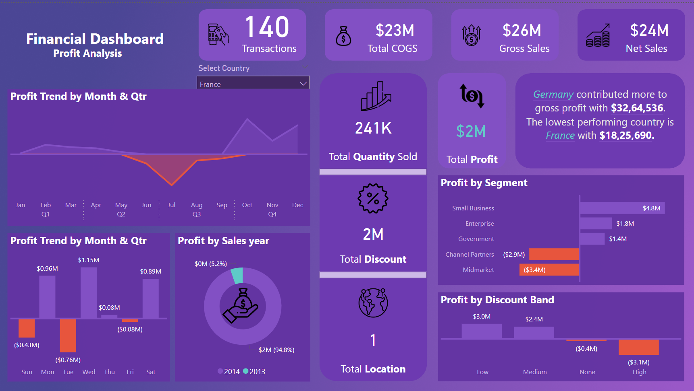

# Profit Analysis Dashboard

Make an incredible Power BI Dashboard to visualize your finance KPI data.

1. **Launching Power BI**: Begin by launching Microsoft Power BI Desktop. Click on the sample data set option under the console view. If you can't find it, navigate to the help section and select examples to load a sample data set.
   
2. **Data Preparation**: Once the sample data is loaded, transform it by selecting 'transform data' to clean and prepare it. Ensure the data types are correct, remove unnecessary columns, and reorder columns as needed.

3. **Creating Measures**: Create necessary measures such as total sales, cost of goods sold, and profit. Use DAX functions like `SUMX` and `CALCULATE` to compute these measures accurately.

4. **Designing the Dashboard**: Build an interactive dashboard by inserting visual elements such as line charts, cards, and tables. Format these visuals by adjusting properties like font size, color, and alignment for a professional look.

5. **Adding Icons and Text**: Enhance the dashboard with icons and text to make it visually appealing and informative. Use tools like MyLogoMaker to find suitable icons and adjust text formatting to clearly represent data points and metrics.

